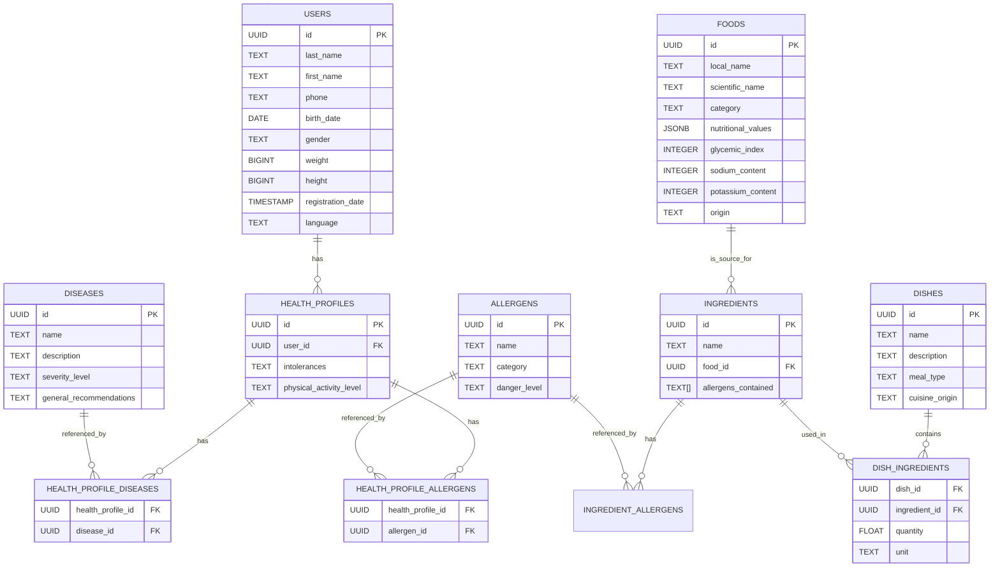

# Diagramme Entité-Relations

Ce fichier contient le diagramme Entité-Relations (ER) généré à partir de `script.sql`.

- Fichier source analysé : `script.sql`

## Diagramme (Mermaid)

Collez le bloc ci-dessous dans un visualiseur Mermaid (VS Code extension "Markdown Preview Mermaid Support" ou la prévisualisation GitHub si prise en charge) pour voir le diagramme.

## Observations / Remarques

- `health_profiles.user_id` référence `users(id)` avec `ON DELETE CASCADE` : chaque profil appartient à un utilisateur (relation un-à-plusieurs possible selon la conception).
- `dish_ingredients` est une table d'association (many-to-many) entre `dishes` et `ingredients` (clé primaire composite `dish_id, ingredient_id`).
- `ingredients.food_id` référence `foods(id)` avec `ON DELETE SET NULL`.
- Les colonnes `chronic_diseases` et `allergies` dans `health_profiles` sont des tableaux de texte (référence indirecte aux tables `diseases` et `allergens` — aucun FK explicite dans le SQL fourni).